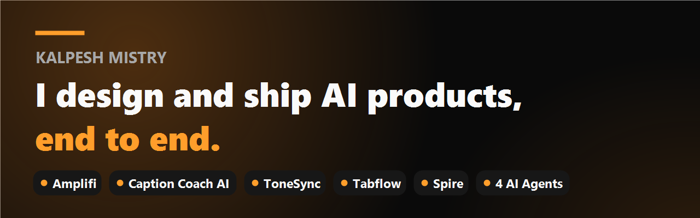

**Every product below is live today. Click any of them.**

## 🚀 Shipped

| Product | What it does | Proof |
|---------|--------------|-------|
| **Amplifi** | One podcast episode becomes six pieces of content in under 60 seconds | [getamplifi.live](https://getamplifi.live) |
| **Caption Coach AI** | iPhone app that learns your writing voice and writes captions in your style | [App Store, 5.0 rating](https://apps.apple.com/us/app/caption-coach-ai/id6765720293) |
| **ToneSync** | Real-time AI writing voice matching, 100% on-device | [Chrome Web Store](https://chromewebstore.google.com/detail/tonesync/annmhejepfahjmiocfpbgecmfjhjlamf) |
| **Tabflow** | Auto-organizes browser tabs by topic using local AI embeddings | [Chrome Web Store](https://chromewebstore.google.com/detail/ieibjndekebpobmgiepaabcnmncgkmkd) |
| **Spire** | iOS tower-stacking game, one-tap gameplay with progression and skins | [App Store](https://apps.apple.com/app/id6776787120) |
| **AI Agents (x4)** | Research, drafting, content repurposing, and inbox triage on autopilot | Running daily |

## 🛠 How I build

**Claude Code** is my development environment, from first idea to deployed product. **Claude** and **GPT** power the AI features, with output quality checks and human review designed in. Under the hood: **Supabase** (auth and data), **Stripe** (payments), **RevenueCat** (subscriptions), **Vercel** (deployment).

The practice behind it: prompt design, output evaluation, model cost and speed tradeoffs, and shipping small versions fast instead of perfect versions never.

## 📡 I build in public

I document every build, the decisions, the failures, and the prompts, every week:

- **[Sunday Signal](https://sundaysignalhq.beehiiv.com)**, my weekly build newsletter
- **@buildwithkp** on TikTok, Instagram, and YouTube Shorts

## 🧭 Where I come from

15+ years as a senior product manager in places where software has to actually work: cut clinician login time 50% for 10,000+ providers across military hospitals (Defense Health Agency), automated FDA regulatory workflows, and delivered payment systems for 38M+ AARP members with zero audit findings. HIPAA, NIST, and federal compliance are second nature.

That is the combination I bring: I build like an engineer, decide like a product manager, and test like a user.

## 📂 About the code

Most of my product code lives in private repos, it is real, revenue-bearing work. The contribution graph tells the story, and every product links to its live, verifiable result above.
## 📫 Connect

[LinkedIn](https://www.linkedin.com/in/kalpeshmistry27) · [sunventures.studio](https://sunventures.studio) · kalpeshmistry27@gmail.com
